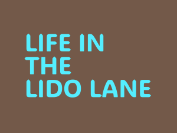
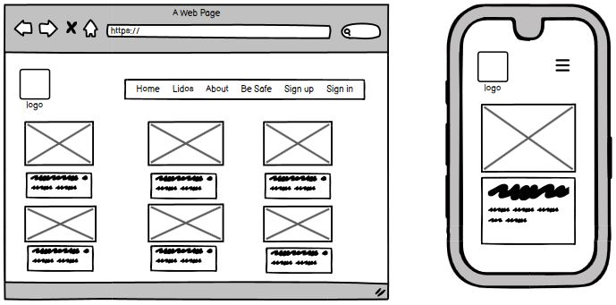
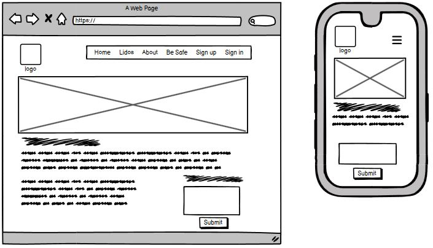
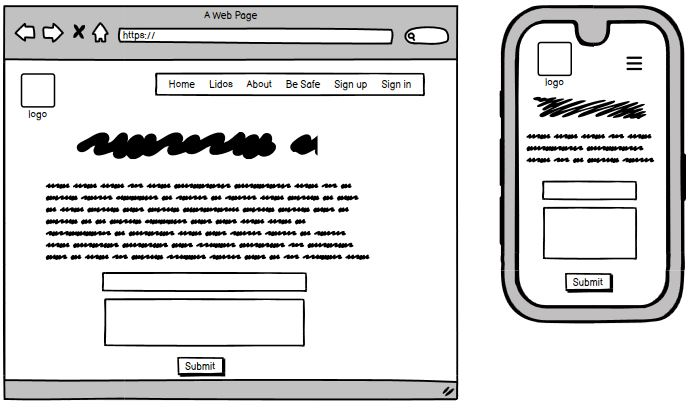
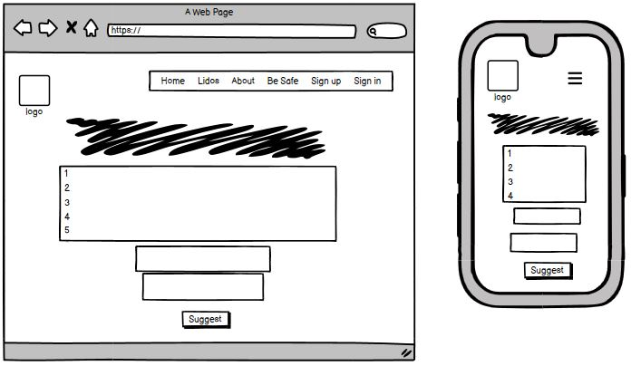
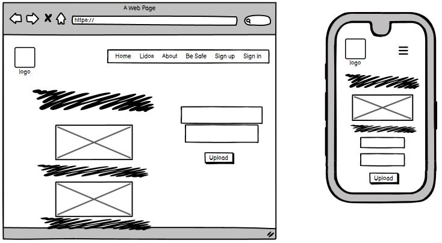
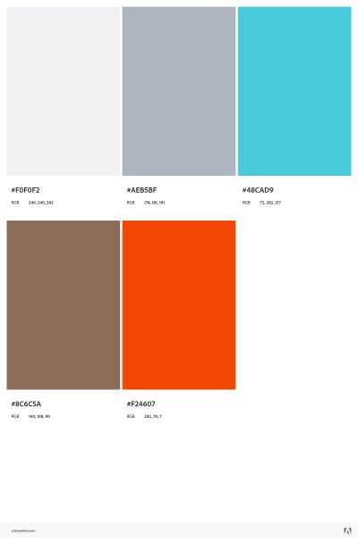
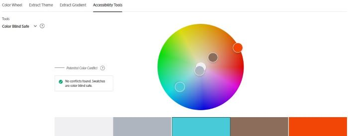
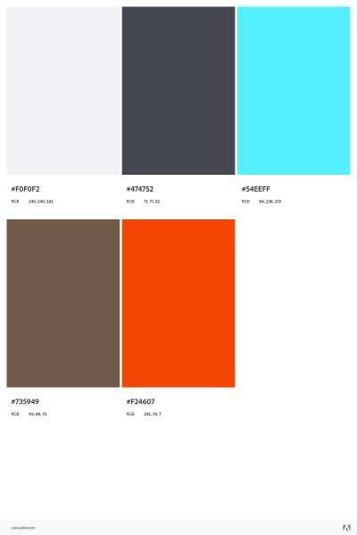
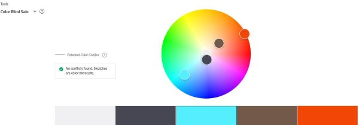

# Life In The Lido Lane

## Contents
1. [Overview](#overview)
    - [Purpose](#purpose)
    - [Target Audience](#target-audience)
2. [UX Design](#ux-design)
    - [User Stories](#user-stories)
    - [Wireframes](#wireframes)
    - [Colour Palette](#colour-palette)

## Overview

### Purpose
This project is intended to give a useful site for open water swimmers looking to visit and swim in the UK's wonderful lidos. It will also give up to date safety advice for new and seasoned open water swimmers. Site users have the opportunity to sign up and, when logged in, they can comment on each of the featured lidos, giving details of a visit or asking a question. They will be able to update or delete this input. Once logged in site users will also be able to upload photos of any lido and, once approved these will be displayed on the gallery page. Any site visitor will be able to suggest a lido to feature without the need for signing up.
A simple approch has been taken to make all lidos easily visible and the site it easy to navigate.

### Target Audience
Following a huge surge in the popularity of open water swimming, particularly in the post covid period, the number of potential site users is growing rapidly. The main target audience will be existing open water swimmers looking for information on UK lido sites and locations. Smaller audiences will be tourists and families looking for local activities and novice open water swimmers looking for safe environments to begin their swimming journeys.

Users will be able to view information on selected lidos to include: location, season length, costs, other facilities eg cafes/changing areas as well as a brief description.

## UX Design

### User Stories

User stories have been selected to reflect the outline of the project above as well as some possible features for future iterations.

#### Must-Have User Stories
**User Story 1:** As a site user I can view a list of info cards so that I can choose the one I want to view in more detail.
- Several posts are displayed on the home page

**User Story 2:** As a site user I can click on an info card so that I can see the full description.

- When an info card is clicked a detailed view is displayed.

**User Story 3:** As a site user I can register an account so that I can comment on lido cards.

- Given an email a user can register an account.
- Then the user can log in.
- When the user is logged in they can comment.

**User Story 4:** As a site user/admin I can login so that I can access different content.

- Login form with feedback and link.

**User Story 5:** As a site admin/user I can log out so that leave the site with my account logged out.

- Log out button with feedback.

**User Story 6:** As a site admin I can create, read, update & delete lido info cards so that I can manage the site content.

- Given a logged in superuser, they can create a lido card.
- Given a logged in superuser, they can read a lido card.
- Given a logged in superuser, they can update a lido card.
- Given a logged in superuser, they can delete a lido card.

**User Story 7:** As a site user I can comment on a lido card so that I can be involved in the dialogue.

- As a logged in user I can comment on lido card.
- When a user comment is approved, then a user can reply.
- Given more than one comment then there is a conversation thread.

**User Story 8:** As a site user I can easily navigate the site so that I can find the pages and info I need.

- The nav bar is easily visible on all pages.
- The nav bar works intuitively.
- The nav bar indicates which page is active.

**User Story 9:** As a site user I can modify or delete my input on a lido card so that I be involved in the site dialogue.

- Given a logged in user, they can modify their comment.
- Given a logged in user, they can delete their comment.

**User Story 10:** As a site owner/site user I can view user comments so that I can see the dialogue.

- Given one or more user comments the admin can view them.
- A site user can click on the comment thread to read the conversation.

**User Story 11:** As a site owner I can add or update the Safety info page so that info is kept up to date.

- The Safety app appears in the admin panel.
- The admin user can access the admin panel.

**User Story 12:** As a site user I can click on a link so that I can view safety advice & guidance.

- When the Safety link is clicked the Safety page can be viewed

**User Story 13:** As a site owner I can add and edit the About page so that content is visible and up to date.

- The About app appears in the admin panel.
- The admin user can access the admin panel.

**User Story 14:** As a site user I can click on a link so that I can view the site About page.

- When the About link is clicked the About page can be viewed.

**User Story 15:** As a site user I can submit a form so that I can suggest a new lido location.

- Form to submit suggestions appears on the About page

**User Story 16:** As a site user I can receive notifications so that I know that my input has been valid.

- notifications appear after an input
- notifications appear after signingin/signing out

#### Should-Have User Stories
**User Story 1:** As a site user I can see paginated info cards so that it is easier to navigate through them.

- Multiple posts are paginated. 

**User Story 2:** As a site user I can click on a link so that I can open a lido's webpage in a separate browser page.

- a link to each lido's website appears on the info card.
- when clicked the page opens in a separate browser page.

**User Story 3:** As a site admin I can approve or reject comments so that I can control site content and filter out inappropriate comments.

- Given a logged in admin user, they can approve a comment.
- Given a logged in admin user, they can reject a comment.

**User Story 4:** As a site user I can add a safety tip so that I can take part in the project.

- when logged in a user can add a suggested safety tip for approval.
- once approved this appears on the safety page.

#### Could-Have User Stories

**User Story 1:** As a site user I can add and remove a lido to a wish-list so that I can remember where I would like to go.

- a 'I'd like to visit' button appears on each lido detail page.
- choices are stored in the user's profile and are accessible when logged in.
- users can delete choices once stored.

**User Story 2:** As a site admin I can create draft content so that I can finish at a later time. 

- Given a logged in superuser, they can save a draft blog post.
- Then they can finish the content at a later time.

**User Story 3:** As a site user I can store suggestions in the database so that I can manage them.

- suggested locations stored in database to be read.
- mark requests as read when dealt with.

**User Story 4:** As a site user I can view pictures of featured lidos so that I get a good experience on landing on the page.

- A gallery carousel appears on the landing page

**User Story 5:** As a site owner I can manage photo uploads so that I can approve acceptable content only.

- gallery app appears in admin panel.
- once approved, images appear on the gallery page.

**User Story 6:** As a site user I can upload a photo so that I can share my experiences.

- a form enables me to upload a photo
- my uploaded photo appears on the site

#### Won't-Have User Stories

**User Story 1:** As a site user I can click on a map link so that I can get directions.

- Google maps embedded in an iframe on each lido card.

**User Story 2:** As a site admin I can create and update an events page so that users can see relevant events.

- The events app appears in the admin panel

**User Story 3:** As a site user I can view a calendar of relevant events so that I can get relevant information.

- when the Events link is clicked the events page is displayed.

**Reflection - the User Stories should be condensed into groups relating to the same feature.**

### Design Decisions

#### Wireframes
Original wireframing has been largely adhered to with some extra images added to improve UX. Images show wireframes for laptop and mobile devices.

##### Home page wireframe 

##### Individual lido entry wireframe 

##### About page wireframe 

##### Safety information page wireframe 

##### Gallery page wireframe 

#### Colour Palette

Adobe Color was used to select a colour palette. The palette was based on an aerial image of the Jubilee Pool, one of my featured lidos, so I felt this was the one to go with providing accesibility checks were aceptable. The colours have been used throughout the project.

On testing the colour palette was found to be colour blind safe. The results are displayed below:

On further testing the contrast ratios were found to be insufficient to adhere to WCAG guidlines and the colour palette was edited and retested for colour blindness compatibility.
New palette:

Retest fo colour blind safe:

Project colours have been adjusted to reflect the new colour palette. Logo files have also been adjusted.

#### Accessibility Considerations
Discuss how accessibility guidelines were adhered to, including colour contrast and alt text for images.  
**Guidance:** Outline how you've incorporated accessibility into your design, ensuring that your project adheres to guidelines such as WCAG.

## AI Tools Usage

### DALL-E
Describe how DALL-E was used for image generation, including examples of successes and challenges.  
**Guidance:** Specifically mention how you used DALL-E for image generation and the impact this had on your design process.

## Features Implementation

### Core Features (Must-Haves)
- **Feature 1:** Description of the implemented feature.
- **Feature 2:** Description of the implemented feature.

(Include all must-have features)  
**Guidance:** Use this section as you complete Phase 2: Must User Stories Implementation & Testing. Document all the must-have features you implemented, explaining how they align with the user stories and acceptance criteria.

### Advanced Features (Should-Haves)
- **Feature 1:** Description of the implemented feature.
- **Feature 2:** Description of the implemented feature.

(Include all should-have features)  
**Guidance:** Include any advanced features you implemented during Phase 3: Should User Stories Implementation & Any Advanced Features. Explain how these features enhance user experience and their alignment with the acceptance criteria.

### Optional Features (Could-Haves)
- **Feature 1:** Description of the implemented feature (if any).
- **Feature 2:** Description of the implemented feature (if any).

(Include any could-have features that were implemented or considered)  
**Guidance:** If any could-have features were implemented, describe them here. This is an opportunity to showcase extra work done beyond the initial scope. But remember - keep it simple! Focus on the Must stories first. Could user story features are commonly earmarked for future project iterations.

## AI Tools Usage

### GitHub Copilot
Describe how GitHub Copilot assisted in coding, including any challenges or adjustments needed.  
**Guidance:** Reflect on how GitHub Copilot assisted in coding, particularly any challenges or adjustments that were needed to align with project goals.

## Testing and Validation

### Testing Results
Summarize the results of testing across different devices and screen sizes.  
Mention any issues found and how they were resolved.  
**Guidance:** Summarize the results of your testing across various devices using tools like Chrome DevTools, as outlined in Phase 2. Mention any issues found and how they were resolved.

### Validation
Discuss the validation process for HTML and CSS using W3C and Jigsaw validators.  
Include the results of the validation process.  
**Guidance:** Document your use of W3C and Jigsaw validators to ensure your HTML and CSS meet web standards. Include any errors or warnings encountered and how they were resolved.

## AI Tools Usage

### GitHub Copilot
Brief reflection on the effectiveness of using AI tools for debugging and validation.  
**Guidance:** Reflect on how GitHub Copilot assisted with debugging and validation, particularly any issues it helped resolve.

## Deployment

### Deployment Process
Briefly describe the deployment process to GitHub Pages or another cloud platform.  
Mention any specific challenges encountered during deployment.  
**Guidance:** Describe the steps you took to deploy your website during Phase 4: Final Testing, Debugging & Deployment, including any challenges encountered.

## AI Tools Usage

### Reflection
Describe the role AI tools played in the deployment process, including any benefits or challenges.  
**Guidance:** Reflect on how AI tools assisted with the deployment process, particularly how they streamlined any tasks or presented challenges.

## Reflection on Development Process

### Successes
Effective use of AI tools, including GitHub Copilot and DALL-E, and how they contributed to the development process.

### Challenges
Describe any challenges faced when integrating AI-generated content and how they were addressed.

### Final Thoughts
Provide any additional insights gained during the project and thoughts on the overall process.  
**Guidance:** Begin drafting reflections during Phase 1 and update throughout the project. Finalize this section after Phase 4. Highlight successes and challenges, particularly regarding the use of AI tools, and provide overall insights into the project.

## Code Attribution
Properly attribute any external code sources used in the project (excluding GitHub Copilot-generated code).  
**Guidance:** Document any external code sources used throughout the entire project, especially during Phase 2 and Phase 3. Exclude GitHub Copilot-generated code from attribution.

## Future Improvements
Briefly discuss potential future improvements or features that could be added to the project.  
**Guidance:** Reflect on potential enhancements that could be made to the project after Phase 4: Final Testing, Debugging & Deployment. These could be Could user story features you didn’t have time to implement or improvements based on testing feedback.

# references
- color.adobe https://color.adobe.com
- unsplah - list people
- code institite
- you tuber if i get the carousel in
- balsamiq
- lucidchart
- cludinary
- heroku
- git pod
- git hub
- [Colour palette testing](https://color.adobe.com/create/color-accessibility)
- color.adobe.com/create/color-contrast-analyzer
