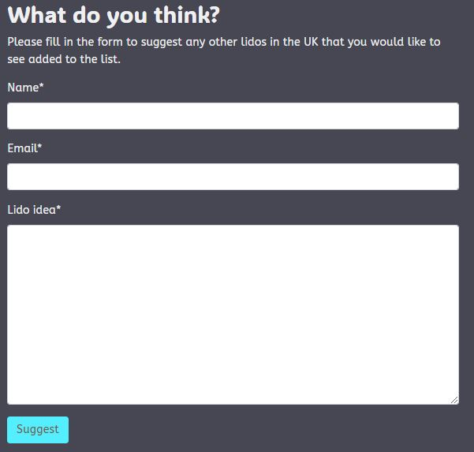

# Life In The Lido Lane

## Contents
1. [Overview](#overview)
    - [Purpose](#purpose)
    - [Target Audience](#target-audience)
2. [ UX Design and Planning](#ux-design-and-planning)
    - [User Stories](#user-stories)
    - [Wireframes](#wireframes)
    - [Colour Palette](#colour-palette)
    - [Typography](#typography)
    - [Accessibility Considerations](#accessibility-considerations)
    - [Database Planning](#database-planning)
3. [Agile Methodology](#agile-methodology)
4. [Features Implementation](#features-implementation)
    - [Home Page](#home-page)
    - [Account Features](#account-features)
    - [About Page](#about-page)
    - [Safety Page](#safety-page)
    - [Gallery Page](#gallery-page)
    - [User Notifications](#user-notifications)
5. [Technologies Used](#technologies-used)
    - [Planning and Design](#planning-and-design)
    - [Languages](#languages)
    - [Frameworks](#frameworks)
    - [Database](#database)
    - [Development](#development)
    - [Installed Django Packages](#installed-django-packages)
    - [Validation and Testing](#validation-and-testing)
    - [Deployment](#deployment)
    - [AI](#ai)
6. [Testing and Validation](#testing-and-validation)
    - [Manual Testing Results](#manual-testing-results)
    - [Lighthouse Testing Results](#lighthouse-testing-results)
    - [Wave Accessibility Testing](#wave-accessibility-testing)
    - [Validation](#validation)
7. [Deployment](#deployment)
    - [Pre Deployment](#pre-deployment)
    - [Deployment Steps](#deployment-steps)
8. [Reflection on Development Process](#reflection-on-development-process)
9. [Future Improvements](#future-improvements)
10. [Credits](#credits)

## Overview

### Purpose
This project is intended to give a useful site for open water swimmers looking to visit and swim in the UK's wonderful lidos. It will also give up to date safety advice for new and seasoned open water swimmers. Site users have the opportunity to sign up and, when logged in, they can comment on each of the featured lidos, giving details of a visit or asking a question. They will be able to update or delete this input. Once logged in site users will also be able to upload photos of any lido and, once approved these will be displayed on the gallery page. A logged in user will be able to update or delete the images they have uploaded. Safety tips can be suggested by a logged in user and will be displayed when approved. Any site visitor will be able to suggest a lido to feature without the need for signing up.
A simple approch has been taken to make all lidos easily visible and the site easy to navigate.

### Target Audience
Following a huge surge in the popularity of open water swimming, particularly in the post covid period, the number of potential site users is growing rapidly. The main target audience will be existing open water swimmers looking for information on UK lido sites and locations. Smaller audiences will be tourists and families looking for local activities and novice open water swimmers looking for safe environments to begin their swimming journeys.

Users will be able to view information on selected lidos to include: location, season length, costs, other facilities eg cafes/changing areas as well as a brief description and whether lifeguards are present or not.

## UX Design and Planning

### Must-Have User Stories
**User Story 1:** As a site user I can view a list of info cards so that I can choose the one I want to view in more detail.
- Several posts are displayed on the home page

**User Story 2:** As a site user I can click on an info card so that I can see the full description.

- When an info card is clicked a detailed view is displayed.

**User Story 3:** As a site user I can register an account so that I can comment on lido cards.

- Given an email a user can register an account.
- Then the user can log in.
- When the user is logged in they can comment.

**User Story 4:** As a site user/admin I can login so that I can access different content.

- Login form with feedback and link.

**User Story 5:** As a site admin/user I can log out so that leave the site with my account logged out.

- Log out button with feedback.

**User Story 6:** As a site admin I can create, read, update & delete lido info cards so that I can manage the site content.

- Given a logged in superuser, they can create a lido card.
- Given a logged in superuser, they can read a lido card.
- Given a logged in superuser, they can update a lido card.
- Given a logged in superuser, they can delete a lido card.

**User Story 7:** As a site user I can comment on a lido card so that I can be involved in the dialogue.

- As a logged in user I can comment on lido card.
- When a user comment is approved, then a user can reply.
- Given more than one comment then there is a conversation thread.

**User Story 8:** As a site user I can easily navigate the site so that I can find the pages and info I need.

- The nav bar is easily visible on all pages.
- The nav bar works intuitively.
- The nav bar indicates which page is active.

**User Story 9:** As a site user I can modify or delete my input on a lido card so that I be involved in the site dialogue.

- Given a logged in user, they can modify their comment.
- Given a logged in user, they can delete their comment.

**User Story 10:** As a site owner/site user I can view user comments so that I can see the dialogue.

- Given one or more user comments the admin can view them.
- A site user can click on the comment thread to read the conversation.

**User Story 11:** As a site owner I can add or update the Safety info page so that info is kept up to date.

- The Safety app appears in the admin panel.
- The admin user can access the admin panel.

**User Story 12:** As a site user I can click on a link so that I can view safety advice & guidance.

- When the Safety link is clicked the Safety page can be viewed

**User Story 13:** As a site owner I can add and edit the About page so that content is visible and up to date.

- The About app appears in the admin panel.
- The admin user can access the admin panel.

**User Story 14:** As a site user I can click on a link so that I can view the site About page.

- When the About link is clicked the About page can be viewed.

**User Story 15:** As a site user I can submit a form so that I can suggest a new lido location.

- Form to submit suggestions appears on the About page

**User Story 16:** As a site user I can receive notifications so that I know that my input has been valid.

- notifications appear after an input
- notifications appear after signingin/signing out

### Should-Have User Stories
**User Story 1:** As a site user I can see paginated info cards so that it is easier to navigate through them.

- Multiple posts are paginated. 

**User Story 2:** As a site user I can click on a link so that I can open a lido's webpage in a separate browser page.

- a link to each lido's website appears on the info card.
- when clicked the page opens in a separate browser page.

**User Story 3:** As a site admin I can approve or reject comments so that I can control site content and filter out inappropriate comments.

- Given a logged in admin user, they can approve a comment.
- Given a logged in admin user, they can reject a comment.

**User Story 4:** As a site user I can add a safety tip so that I can take part in the project.

- when logged in a user can add a suggested safety tip for approval.
- once approved this appears on the safety page.

### Could-Have User Stories

**User Story 1:** As a site user I can add and remove a lido to a wish-list so that I can remember where I would like to go.

- a 'I'd like to visit' button appears on each lido detail page.
- choices are stored in the user's profile and are accessible when logged in.
- users can delete choices once stored.

**User Story 2:** As a site admin I can create draft content so that I can finish at a later time. 

- Given a logged in superuser, they can save a draft blog post.
- Then they can finish the content at a later time.

**User Story 3:** As a site user I can store suggestions in the database so that I can manage them.

- suggested locations stored in database to be read.
- mark requests as read when dealt with.

**User Story 4:** As a site user I can view pictures of featured lidos so that I get a good experience on landing on the page.

- A gallery carousel appears on the landing page

**User Story 5:** As a site owner I can manage photo uploads so that I can approve acceptable content only.

- gallery app appears in admin panel.
- once approved, images appear on the gallery page.

**User Story 6:** As a site user I can upload a photo so that I can share my experiences.

- a form enables me to upload a photo
- my uploaded photo appears on the site
- I can edit or delete my uploaded images

### Won't-Have User Stories

**User Story 1:** As a site user I can click on a map link so that I can get directions.

- Google maps embedded in an iframe on each lido card.

**User Story 2:** As a site admin I can create and update an events page so that users can see relevant events.

- The events app appears in the admin panel

**User Story 3:** As a site user I can view a calendar of relevant events so that I can get relevant information.

- when the Events link is clicked the events page is displayed.

#### **Reflection**
The User Stories should be condensed into groups relating to the same feature so that each User Story will have more associated tasks. Fewer User Stories will make it easier to manage the project board 

### Wireframes
Original wireframing has been largely adhered to with some extra images added to improve UX. Images show wireframes for laptop and mobile devices.

#### Home page wireframe 

#### Individual lido entry wireframe 

#### About page wireframe 

#### Safety information page wireframe 

#### Gallery page wireframe 

### Colour Palette

Adobe Color was used to select a colour palette. The palette was based on an aerial image of the Jubilee Pool, one of my featured lidos, so I felt this was the one to go with providing accesibility checks were aceptable. The colours have been used throughout the project.

On testing the colour palette was found to be colour blind safe. The results are displayed below:

On further testing the contrast ratios were found to be insufficient to adhere to WCAG guidlines and the colour palette was edited and retested for colour blindness compatibility.
New palette:

Retest for colour blind safe:

Project colours have been adjusted to reflect the new colour palette. Logo files have also been adjusted.

### Typography

ADLaM Disply is used for headings and ABeeZee is used for text. ABeeZee is a clean and modern sans-serif font designed for easy readability. It features simple straightforward design with slightly rounded edges. Overall, it is a user-friendly attractive font that can enhance readability. Paired with ADLaM Display it creates an accessible typography system.

### Accessibility Considerations
Careful consideration given to colour palette, see the section above. Images have alt text attributes and aria labelling means that screen readers will be able to access the site.

### Database Planning

In order to facilitate ease of implementation of current and future features the following ERD was developed for this project. The tables headed with a green cell are for Must Have features, peach cells are for Should Have features and yellow cells are for Could Have features. All but one of these has been used in the initial sprint. The VisitList model may be implemented in a future sprint.

## Agile Methodology

An agile working methodology was used during the project with a GitHub project board being the basis of this method.

[Project board link](https://github.com/users/katepz/projects/5)

This completed sprint involved the completion of 24 items. The MoSCoW approach to prioritisation was used to ensure that the MVP was completed in good time. Initially all items were placed in the Backlog and as they were moved to To Do, In Progress and Done columns in the board the milestone was changed for a visual check on the progress of the project. Of the 24 items completed 16 had been designated as Must Haves, 4 as Should Haves and 4 as Could Haves. 2 Could Haves remain in the Backlog for a future sprint as well as 3 items that were designated as Won't Haves as they were beyond the scope of the initial project. As in the refelection above, User Stories could have been grouped better by the feature that they relate to.

### Images of the Project Board 
#### In Progress:

#### Completed:

## Features Implementation

### Home Page: 
**List of featured lidos on Home page and a detailed view of each lido when clicked on. Comment on a featured lido and view comments.**

### Account Features: 
**Account functionality - register an account, log in, log out.**

As the mock-up generator is not signed in it can not display the logout page so this is an example of that page from a laptop size screen.

### About Page: 
**Add and manage About page. View About page. Suggest a lido to feature via About page.**

### Safety Page: 
**Add and manage Safety page. View Safety page. Suggest a safety tip via About page.**

### Gallery Page: 
**Add and manage Gallery page. View Gallery page. Upload an image via Gallery page. Update or delete content on Gallery page**

### User Notifications: 
**Users receive notifications when they interact with the application.**

### Site Management
**Apps appear in admin panel**

## Technologies Used

### Planning and Design
- GitHUb - project board
- Lucidchart - ERD for database
- Balsamiq - for wireframe diagrams
- Adobe Color - for palette selection
- Font Forge - for selecting accessible font pairing
- Cloudinary - for hosting images
- Unsplash - for royalty free images
- Google Fonts - custom font styling
- Favicon generator - to produce favicon
- Logo.com - free logo maker
- Techsini.com - mockup generator

### Languages
- HTML5 - for templates
- CSS3 - for styling
- Python3 - for views, models, logic in templates
- Javascript - update and delete functionality
- Markdown - for README.md

### Frameworks
- Bootstrap5 - styling & responsiveness
- Django4 - full stack project building

### Database
- Postgres - supplied via Code Institute

### Development
- Git - for version control
- Gitpod - IDE
- GitHub - set up and management of repo from a CI template, use of project board for planning and agile methodologies, link to heroku for deployment

### Installed Django Packages
- Cloudinary - image handling
- Allauth - for secure account handling
- Summernote - for improved comment input
- Gunicorn - web serving
- Crispy forms - form use
- Whitenoise - white noise handling

### Validation and Testing
- HTML - The W3C Markup validation Service
- CSS - The W3C CSS Validation Service
- Python - The Code Institute Python Linter
- Lighthouse
- Wave
- JS Hint - for JavaScript

### Deployment
- Heroku 

### AI
- Chatgpt - bug fixing suggestions, assistance in model structure and implementing update and delete on gallery page

## Testing and Validation
### Manual Testing Results
The following table shows the results of testing the functionality fo the application.

All test actions behaved as expected except the responsiveness of the page detailing individual lidos. This has been addressed by adding a media query to display the image underneath the lido name for mobile screen sizes.

### Lighthouse Testing Results
#### Mobile

#### Desktop

Main issues with performance were with images - suggested change of format from png and jpg to next gen formats.

### Wave Accessibility testing
No errors were detected.

### Validation
#### HTML
No errors were found when passing through W3C HTML validator. Some warnings for unneeded trailing slashes on hr elements which were removed.

#### CSS
No errors were found when passing through W3C CSS validator. Some recommendations for duplicate css classes. This will be tackled in the next sprint. 

#### Python
Some spacing errors were found and corrected when using the CI Python Linter tool. The image shows the main views.py file after corrections.

#### Javascript
No errors found when tested using JS Hint. 

## Deployment

The deployed project can be found at:
[Deployed Site](https://life-in-the-lido-lane-2b0dc6519e2c.herokuapp.com/)

This project was deployed to Heroku from the main branch of the Life In The Lido Lane repository on GitHub. 

The project was reployed  after new features were made functional so that continuous checking of the deployed site could be made and any errors picked up early.

### Pre Deployment
- requirements.txt file to be up to date with installed Python modules needed for effective deployment
- Procfile used to configure the application as a gunicorn web app
- runtime.txt populated with Python version for Heroku to use
- Add Heroku to allowed apps in IDE project settings.py file
- Obtain Cloudinary API key to create the CLOUDINARY_URL
- Generate SECRET_KEY
- Environment variables of a senstive nature - DATABASE_URL, CLOUDINARY_URL, SECRET_KEY - to be added to env.py file which is not pushed to GitHub

### Deployment Steps
- Create Heroku account
- Create a new Heroku app
- Select region as Europe
- Add environment variables manually to Heroku in the Config Vars section
- Connect Heroku to GitHub repository using the search function
- Once branch is merged successfully with the main branch in the GitHub repo the main branch can be deployed
- In Heroku dashboard click on Deploy tab - see image below
- Make sure main branch is selected for deployment, click Deploy - see image below
- Once the build process has finished click to open the app - see image below

## Reflection on Development Process

### Successes
The use of the GitHub project board was excellent for managing workload and workflow. Deployment was generally successful with only a couple of minor deployment issues relating to incorrect config vars and static files. Both issues were rectified easily. the vast majority of minor bugs were able to be identified easily and rectified quickly. The time spent at the start of the project on planning the database tables lead to no errors in models and there was no need to readjust models once created and migrated.

### Challenges
The main challenges were: integrating experience to date with the new project; correct set-up of repo, IDE, Heroku, Cloudinary; the links between them; generating good content.

## Future Improvements
Future improvement will include implementation of the remaining Could Have and Won't Have User Stories from this sprint. This will be a link on each individual Lido page to add it to a visit list that would be stored in the users profile. Also to enhance UX there would be an image carousel on the top of the home page or potentially as a landing page.

As part of the validation process some duplicate CSS classes were identified and these would be adjusted to improve performance. This was not judged to be a priority in this sprint as performance scores were good. As well as this the warnings recived from JS Hint will be acted on.

There is an issue with responsivity of the lido detail page on a mobile screen. The page displays with the image underneath the lido name but there is too much space between the image and the text. This would be fixed in a future iteration.

The form for uploading an image on the gallery page appears at the bottom of the images on mobile devices. In a future iteration this form would be underneath the text at the top of the page for a better UX.

The labels for the built in form fields for crispy forms also need styling which will be done in a future sprint.

The issue highlighted on the performance test with image file types will also be addressed in future.

## Credits
### Code
- The project is inspired by the Codestar Blog project from the Code Institute LMS and some of the code and processes from that project has been used as a starting point for this one
- Django documentation has been used to cross check correct configurations of aspects of the project
- Chat GPT gave some suggestions for model structure which was adapted to fit the database schema
- Chat GPT gave some ideas for the implementation of the update/delete functions on the Gallery page
- Google fonts used for embedded code for typography

### Content
- Individual lido web pages for info and images
- Unsplash for free to use stock images

### People
- John and Roo on the Code Institute  Coding Coach Channel for expert help when needed
- Other members of the Headforwards September 24 Cohort for help and support